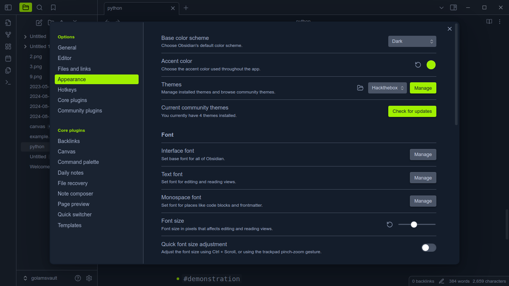

# Obsidian theme for hackthebox

A [Hackthebox Academy](https://academy.hackthebox.com/) inspired theme for [Obsidian](https://obsidian.md/).




## Installation

### Auto install

1. Open **Settings** (bottom left corner ⚙️).
1. Go to **Appearance** tab.
1. Inside **Themes** click **Manage**.
1. Search for `Hackthebox` in the Search field text.
1. Click `Install and use` and then you're done! 🎉🥳

### Manual install

1. Move to the themes direcory of your vault.

   ```bash
   cd path/to/vault/.obsidian/themes
   ```

1. Clone the repo.
   ```bash
   git clone https://github.com/golam71/obsidian-hackthebox Hackthebox
   ```
1. Click the settings icon or press `Ctrl+,`.

1. Under `Options` go to `Appearance` in `Themes` dropdown select `Hackthebox`.

1. Enjoy! 🎉🥳

## Additional information

- Any PR or contributions are welcome.
- Code documentation is [here](code.md)
- More images can be found inside [images](img)

## Acknowledgement & Credits

- [Hackthebox Academy](https://academy.hackthebox.com/)
- [HTB Vscode Theme](https://github.com/silofy/hackthebox)
- mto , calc, bingbong, goblin ([HTB discord memebers](https://discord.com/invite/hackthebox))
